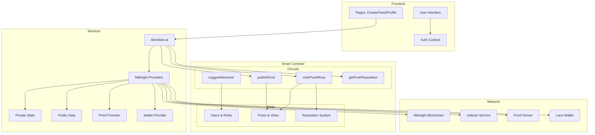

# Rebels. ZK Decentralized Journalism Platform.

## Project Vision

**"Protecting Democracy Through Zero-Knowledge Journalism"**

A censorship-resistant publishing platform that enables journalists to provide content anonymously through community-driven verification and reputation systems. Leveraging Zero-Knowledge proofs provided by Midnight blockchain, Rebels implements a dApp enabling users and journalists to share information freely without government censorship.

## Deploying the frontend
``` bash
# Execute this command at root
bun i

# change to frontend-vite.react
bun run dev
```

## Core Architecture

### Two-Tier Verification System

The platform implements a **Proof of Humanity + Journalist Verification** model:

```
1. HUMAN VERIFICATION → 2. JOURNALIST REFERRAL → 3. CONTENT PUBLISHING
   (Human Authority)     (Community Consensus)    (Anonymous Publishing)
```

### Problem & Solution
- **132 journalists killed in 2025** - Need anonymous, credible publishing
- **Existing platforms** - Either no anonymity OR no credibility verification
- **Our solution** - Zero-knowledge proofs + community consensus = anonymous credibility

## Technical Architecture



**Architecture Layers:**
1. **Frontend** - React/Vite interface with authentication
2. **Services** - Contract interactions via Midnight providers
3. **Smart Contract** - State management and circuit functions
4. **Network** - Midnight blockchain infrastructure

## Smart Contract Overview

### Core Ledgers

| Ledger | Type | Purpose |
|--------|------|---------|
| `humans` | `Set<Bytes<32>>` | Verified human identities (PoH) |
| `journalists` | `Set<Bytes<32>>` | Verified journalist public keys |
| `userReputation` | `Map<Bytes<32>, Uint<64>>` | Reputation scores (starts at 1000) |
| `posts` | `Map<Uint<64>, Post>` | All published content |
| `referrals` | `Map<Bytes<32>, Uint<2>>` | Referral count per journalist (max 2) |

### Key Functions

**Human Verification**
```compact
addNewHuman(pk: Bytes<32>) // Only HUMAN_AUTHORITY
```

**Journalist Onboarding**
```compact
suggestNewUser(pk: Bytes<32>) // Existing journalists refer new ones
```

**Content Publishing**
```compact
publishPost(content: Opaque<"string">): Uint<64> // Returns post ID
```

**Community Voting**
```compact
votePlus(postId: Uint<64>)   // +10 reputation to author
voteMinus(postId: Uint<64>)  // -10 reputation to author
```

**Content Moderation**
```compact
flagPost(postId: Uint<64>)           // Community flagging
removeIllegalContent(postId: Uint<64>) // Authority removal
```

## User Flows

### Human → Journalist → Publisher
```
1. Human Authority verifies real humans
2. Existing journalists refer trusted humans
3. New journalists can publish content
4. Community votes on content quality
```

### Reputation System
- Start with 1000 reputation
- +10 points per upvote
- -10 points per downvote
- Reputation affects credibility

## Frontend Integration

### User State
```javascript
{
  isHuman: boolean,
  isJournalist: boolean, 
  reputation: number,
  referralsUsed: number,
  publicKey: string
}
```

### Post State
```javascript
{
  id: number,
  author: string,
  content: string,
  plusVotes: number,
  minusVotes: number,
  hasUserVoted: 'plus' | 'minus' | null
}
```

## Security Features

### Zero-Knowledge Privacy
- Anonymous publishing via ZK proofs
- Vote privacy (votes not linkable to identity)
- Referral privacy

### Attack Prevention
- **Sybil Resistance**: Human verification + limited referrals
- **Vote Manipulation**: One vote per user, no self-voting
- **Content Quality**: Community voting + flagging

## Technical Stack

- **Blockchain**: Midnight Network (ZK-enabled)
- **Smart Contract**: Compact language
- **Frontend**: React + Vite + TypeScript
- **Wallet**: Lace integration
- **Providers**: Midnight.js SDK

## Value Proposition

- First zero-knowledge journalism platform
- Anonymous yet credible publishing
- Community-driven quality control
- Censorship-resistant infrastructure
- Real impact for press freedom

---

**Built by Midnames**
