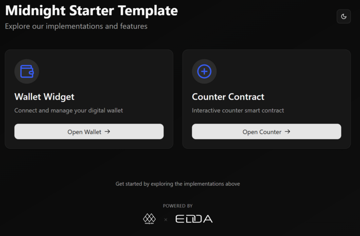

# 🚀 MESH - Midnight Starter Template
A starter template for building on Midnight Network with React frontend and smart contract integration.


## 📦 Prerequisites

- [Node.js](https://nodejs.org/) (v18+) & [npm](https://www.npmjs.com/) (v9+)
- [Docker](https://docs.docker.com/get-docker/)
- [Git LFS](https://git-lfs.com/) (for large files)
- [Compact](https://docs.midnight.network/relnotes/compact-tools) (Midnight developer tools)

## 🛠️ Setup

### 1️⃣ Install Git LFS

```bash
# Install and initialize Git LFS
sudo dnf install git-lfs  # For Fedora/RHEL
git lfs install
```

### 2️⃣ Install Compact Tools

```bash
# Install the latest Compact tools
curl --proto '=https' --tlsv1.2 -LsSf \
  https://github.com/midnightntwrk/compact/releases/latest/download/compact-installer.sh | sh
```
```bash
# Install the latest compiler
compact update
```

### 3️⃣ Install Node.js and docker
- [Node.js](https://nodejs.org/) (v18+) & [npm](https://www.npmjs.com/) (v9+)
- [Docker](https://docs.docker.com/get-docker/)

### 4️⃣ Verify Installation
```bash
# Check versions
node -v  # v18+
npm -v   # v9+
docker -v
git lfs version
compact check  # Should show latest version
```

## 📁 Project Structure

```
├── counter-cli/         # CLI tools
├── counter-contract/    # Smart contracts
└── frontend-vite-react/ # React application
```

## 🔗 Network Configuration

### Testnet Network

1. **Set Network ID**
   - Open `frontend-vite-react/src/App.tsx`
   - Ensure `setNetworkId(NetworkId.TestNet)` is set  

2. **Configure Contract Address**
   - In the same file, locate the `contractAddress` constant
   - Replace with a Counter Testnet-network contract address

3. **Start Development**
   ```bash
   # In one terminal (from project root)
   npm install
   npm run build
   npm run start-app-testnet
   ```

### Undeployed/Local Network

1. **Configure Your own wallet Address**
   - Open `counter-cli/src/scripts/prepare-standalone.test.ts`
   - Replace with your own undeployed-network wallet address  

2. **Set Network ID**
   - Open `frontend-vite-react/src/App.tsx`
   - Change to `setNetworkId(NetworkId.Undeployed)`  

3. **Start Local Development**
   ```bash
   # In one terminal (from project root)
   npm install
   npm run build
   npm run dev:undeployed-instances
   
   # In another terminal (from project root)
   npm run start-app-undeployed
   ```

3. **Configure Contract Address**
   - You will need to deploy a new contract in the undeployed-network first
   - Open `frontend-vite-react/src/App.tsx`, locate the `contractAddress` constant, and replace it with the newly deployed contract address
---

<div align="center"><p>Built with ❤️ by <a href="https://meshjs.dev">Mesh</a> × <a href="https://eddalabs.io">Edda Labs</a></p></div>
