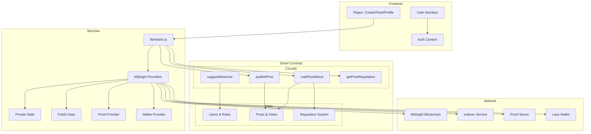

# Rebels Contract Architecture Overview

Here's a comprehensive Mermaid diagram showing the architecture and data flow of the Rebels decentralized journalism platform:

## Key Architecture Components:

### 1. **Smart Contract Layer (Compact Language)**
- **Public Ledger State**: All data stored on-chain including posts, votes, reputation, and user roles
- **ZK Circuits**: Privacy-preserving functions that prove user identity without revealing secret keys
- **Role System**: Humans (verified users), Journalists (can post), Authority (content moderation)

### 2. **Frontend Application (React)**
- **Authentication**: Secret key-based identity system with public key derivation
- **Wallet Integration**: Lace wallet for transaction signing and fee payment
- **Provider Architecture**: Modular providers for state, proofs, and blockchain interaction

### 3. **Trust & Reputation System**
- Users start with 1000 reputation points
- +10 for upvotes received, -10 for downvotes
- Reputation influences content credibility

### 4. **Referral System**
- Each user can refer up to 2 new journalists
- Must be verified as human first
- Tracked on-chain to prevent abuse

### 5. **Content Moderation**
- Community voting (plus/minus votes)
- Flag system for inappropriate content
- Authority role for illegal content removal

### 6. **Zero-Knowledge Features**
- Secret keys never exposed
- Public keys derived deterministically
- All actions proven without revealing identity

The system creates a decentralized, censorship-resistant journalism platform where content credibility is determined by community consensus while maintaining user privacy through zero-knowledge proofs.